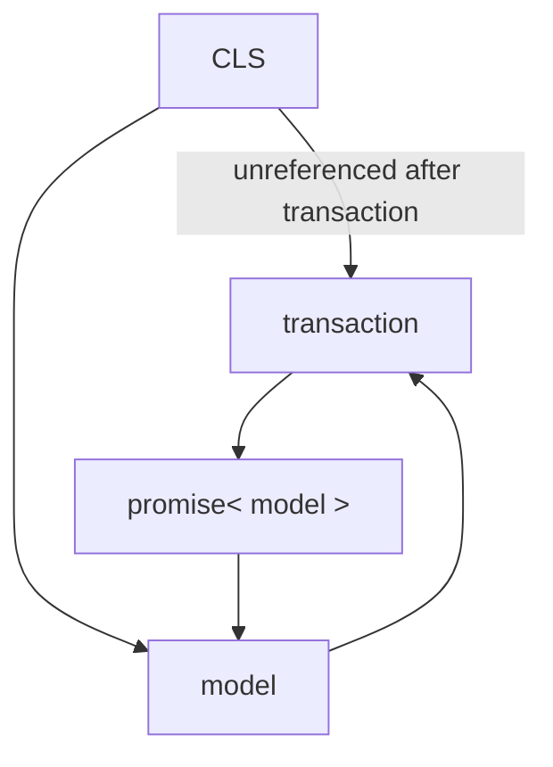

# Introduction

This is intended to reproduce an issue we have encountered on Sequelize v6 since the introduction of https://github.com/sequelize/sequelize/pull/15818 when using CLS with Sequelize.

This change copied the transaction onto the options object during load/update/etc operations and that reference seems to be retained through the \_options object on the returned model (but only on included relations, not the model itself!).

In our code we are, indirectly, storing a promise for the loaded model on the sequelize transaction, and then, once loaded, we store a reference to the model itself on cls. We, therefore, indirectly store a reference to a promise on cls and the cls state associated with this promise can now never be destroyed.

